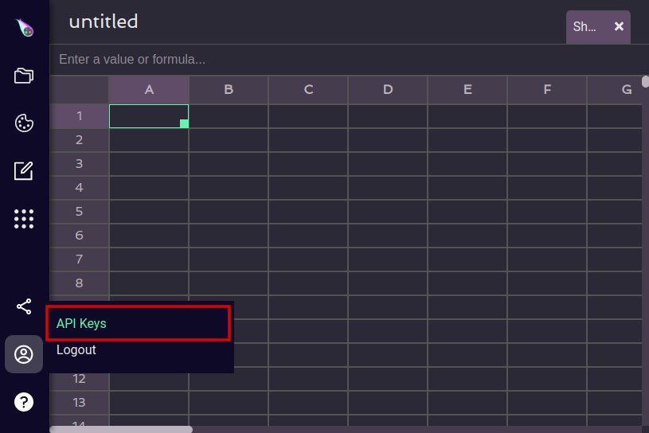

# srk - the SheetRocks Command Line Interface

This tutorial will walk you through how to connect your dev environment to SheetRocks and how to push a pre-existing custom formula. It will help to have programming experience. At the end of this doc there is some bonus content about the nuances of writing your own custom formulas.

## 1. Download the repository

Download or clone the repository.

```
git clone https://github.com/sheetrocks/srk.git
```


## 3. Generate an API key

First, you'll need to log in and either create an API key or use an existing one (open SheetRocks, log in, create a workbook, hover on Profile, click API keys, and click Create API key). Copy the key to your clipboard.




## 5. Set your API key

On Mac:
```
export SRK_TOKEN=your_api_key_here
```

On Windows (Command Prompt):
```
setx SRK_TOKEN your_api_key_here
```

On Windows (PowerShell):
```
$env:SRK_TOKEN="your_api_key_here"
```

On Linux:
```
export SRK_TOKEN=your_api_key_here
```


## 6. Push the function to SheetRocks

Push the example formula located at `srk/examples/python/sumplusone` to SheetRocks.

On Mac:
```
srk.mac push /path/to/srk/examples/python/sumplusone/config.json
```

On Windows (Command Prompt):
```
srk.exe push /path/to/srk/examples/python/sumplusone/config.json
```

On Windows (PowerShell):
```
srk.exe push /path/to/srk/examples/python/sumplusone/config.json
```

On Linux:
```
srk push /path/to/srk/examples/python/sumplusone/config.json
```

## 7. Success

If successful, you will see
```
🎉 Success! You have pushed your formula "SUMPLUSONE" to SheetRocks 🎉
```
**Once your formula is loaded, you can immediately visit a SheetRocks sheet and use your new formula.** 

# 7b. Troubleshooting pushing a formula

On a Mac you might receive the error message 

```
srk.mac cannot be opened because the developer cannot be verified
```

To get around this, navigate to 

```
Apple menu > System Preferences > Security & Privacy > General
```

At the bottom of the window there should be a message that reads

```
srk.mac was blocked because it is not from an identified developer 
```

Hit `Allow Anyway` next to this message.


Run the `push` command again.
```
srk.mac push /path/to/srk/examples/python/sumplusone/config.json
```

Hit `open` when asked if you want to open `srk.mac`.


---

It’s possible that you might encounter some error messages as you are trying to follow the steps above. The errors should be descriptive enough to help you figure out what’s going on, but if you get stuck please contact support through the web-app and we can help you troubleshoot more!


---

# Writing Custom Formulas

## Creating a formula

For the purposes of this tutorial, there is a completed example in the `examples/python` folder. 
To make a new formula, follow the conventions of the example:
- The python formula must be called `calculate`
- The python function will be sent a list of arguments, cast as a spreadsheet castable type:
    * None (for empty cells)
    * float
    * string
    * datetime
    * bool
    * A two dimensional list of the primative types above (this represents a range such as A1:C3).
- The return value must be a spreadsheet castable type as defined above. If the output is a 2D list, it will overwrite
cells.

## Creating a help file

Please follow the supplied convention for help files. For reference see the `help_format.md` file in this directory and the completed example at `/examples/sumplusone/sumplusone.md`. 

- All `#` shown are required for headers. `---` is used to separate sections and is also required.

- The description for a formula must start with `Returns`.

- Optional arguments are enclosed in brackets [] and should specify default value if not given.

- In the `## Examples` section, you may include an `EXAMPLE_RANGE` that will format to appear as a spreadsheet snippet, with the top left most value appearing in cell `A1`. You can then reference these cells in your examples to show how the formula would be used in a sheet.

- In the `## Related Formulas` section, urls should be formatted as `formulas/relatedformulaname`.

## Creating a config file

You must include with your formula and help document a `config.json` file. This file includes metadata about your formula and the paths to the required files. See `/templates/config_template.json` and the completed example at `/examples/python/sumplusone/config.json`.

